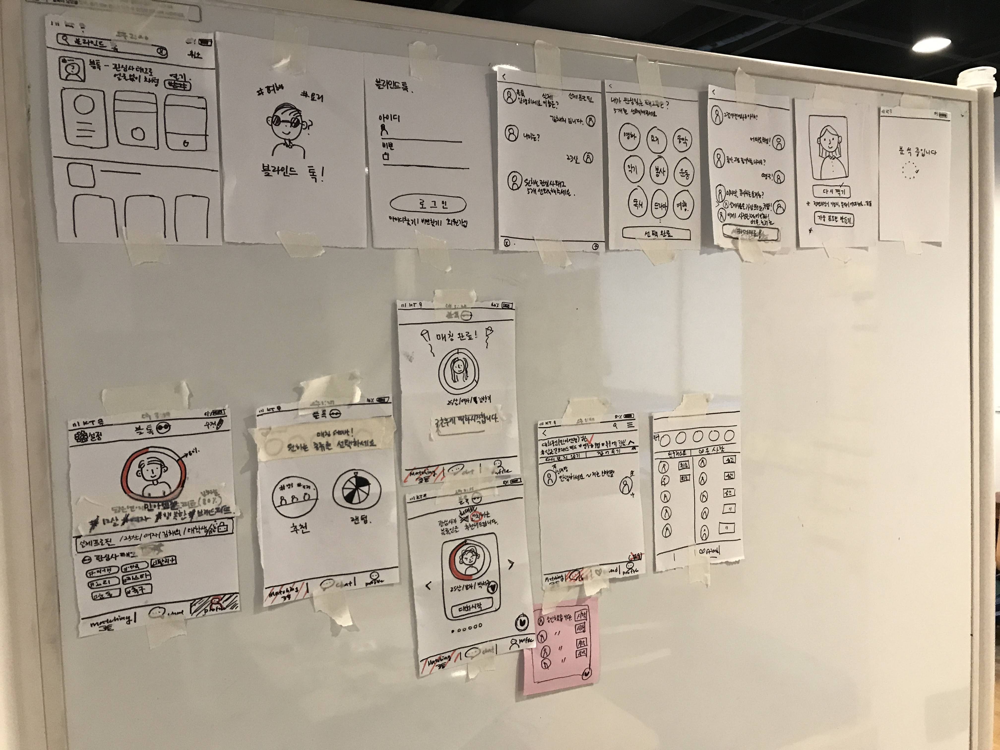
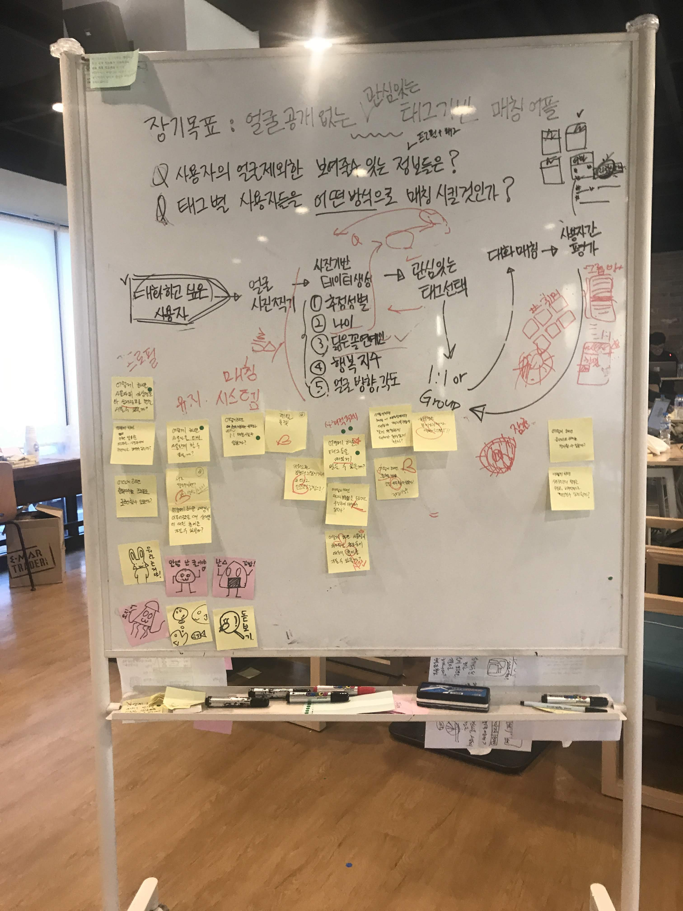

# 동물의 사생활 (Privacy of Animal)

## 프로젝트 소개

"동물의 사생활"은 현대사회의 외모지상주의에 지친 현대인들에게 채팅어플을 통해 더 많은 기회를 제공해주고자 하는 프로젝트입니다. 현재 많은 채팅/소개팅 어플이 있지만 많은 어플들이 사진을 필수로 요구하는 경우가 많고 사진이 필수가 아니더라도 많은 사용자들이 상대방의 사진을 필요로 하기 때문에 외모에 자신감이 없는 이들은 사람과 대화할 수 있는 기회가 적을 가능성이 높습니다. 따라서 저는 **대학교의 졸업 프로젝트로, 외모에 자신감이 없는 사람들도 다른 사람들과 대화할 수 있는 환경을 구축해주는 어플을 만들게 되었습니다.** 비록, 완벽하게 만들지 못해서 런칭하진 못했지만 새로운 프레임워크를 사용하고 여러가지 이슈들을 해결하면서 많은 것들을 배울 수 있었습니다.

## 앱 동작화면

|                       홈                       |                     로그인                      |                     회원가입                     |
| :--------------------------------------------: | :---------------------------------------------: | :----------------------------------------------: |
|  |  |  |

|                   태그선택                    |                   태그상세 채팅                   |                   얼굴 분석 대기                   |
| :-------------------------------------------: | :-----------------------------------------------: | :------------------------------------------------: |
|  |  |  |

|                   얼굴분석 결과                    |                      프로필                       |                     친구목록                      |
| :------------------------------------------------: | :-----------------------------------------------: | :-----------------------------------------------: |
|  |  |  |

|                   친구신청 목록                   |                      채팅목록                      |                      채팅                      |
| :-----------------------------------------------: | :------------------------------------------------: | :--------------------------------------------: |
|  |  |  |

|                   관심사 매칭                    |                 관심사 매칭 결과                 |                     랜덤 매칭                     |
| :----------------------------------------------: | :----------------------------------------------: | :-----------------------------------------------: |
|  |  |  |

|                  랜덤 매칭 결과                   |
| :-----------------------------------------------: |
|  |

## 사용해 본 기술 및 프로그램들과 배운 것들

|                  프로젝트 기획                  |                  프로토타입                   |                     언어                     |                   프레임워크                    |
| :---------------------------------------------: | :-------------------------------------------: | :------------------------------------------: | :---------------------------------------------: |
|  |  |  |  |
|            **Google Design Sprint**             |                   **Figma**                   |                   **Dart**                   |                   **Flutter**                   |

|                유명인 및 감정추출                |                    좌표 추출                     |                    데이터베이스                    |
| :----------------------------------------------: | :----------------------------------------------: | :------------------------------------------------: |
|  |  |  |
|               **Kakao Vision API**               |               **Naver Clova API**                |                    **Firebase**                    |

### Google Design Sprint

구글의 디자인 스프린트는 구글 벤쳐스가 개발한 아이디어 검증 기법입니다. 처음엔 별로 시덥지 않은 방법이라고 생각했지만 이를 통해서 확실한 주제가 없었던 저희 팀에게 보다 확실한 아이디어를 결정짓게 하였고 끊임없는 논의와 다른 사람들의 평가를 통해서 기획 단계에서 조금이나마 더 검증하고 확실히 할 수 있었습니다.

| 스프린트1                                         | 스프린트2                                         |
| ------------------------------------------------- | ------------------------------------------------- |
|  |  |

### Figma

프로토타입을 작성해본 적이 없었던 와중에 Figma라는 툴이 새롭게 나오게 되었고 이걸 프로젝트에 적용하여 프로토타입을 작성해보면 좋을 것 같다고 말씀하셔서 적용하게 되었습니다. 사실상 기술적인 면과 크게 관련되어 있진 않지만 프로토타입을 작성하면서 배웠던 점은 개발을 하기전에 **뭘 개발해야 할지 명확하게 파악할 수 있었다는 점** 입니다. 본래, 개발을 할 때는 의식의 흐름으로 개발을 하고는 했는데 프로토타입을 통해서 **체계적인 구조를 세우는 방법과 실제로 시연해봄으로써 발생할 수 있는 버그/예외 케이스 등에 대해 예측** 할 수 있었습니다.

### Dart & Flutter

어플을 만들 때 기존 방식을 사용하면 Java/Swift를 사용해서 안드로이드/iOS를 각각 개발하는 것이 일반적인데, 프로젝트를 진행하던 시기에 마침 크로스 플랫폼 프레임워크인 Flutter가 베타버전으로 나왔습니다. 바로 적용해보고자 했지만 프레임워크가 Dart라는 언어를 사용했기 때문에 해당 언어도 배우게 되었습니다. 결국, 새로운 언어와 새로운 프레임워크를 배워야했고 정말 낯설었지만 이런 환경을 통해 **공식문서로 학습하는 방법과 깃헙 이슈를 이용해 커뮤니케이션 하는 방법** 을 배울 수 있었습니다. 아래 사진은 제가 Flutter 저장소에 문의했던 이슈들입니다.

### Firebase

이제까지 데이터베이스를 사용해본 적은 MySQL이 전부였고 클라우드 서비스를 사용해 본적이 없었습니다. 물론 유명한 AWS가 있었지만 교수님께서 서비스가 활성화되기 전까진 Firebase가 가성비와 사용법이 좋다고 하셔서 사용해보게 되었습니다. Firebase에는 여러가지 서비스들이 있는데 전 여기서 Firebase authentication, Cloud Function, Cloud Firestore를 적용하였고 실험적으로 Firebase ML Kit 또한 사용해보았습니다. **Authentication과 Cloud Function을 통해선 클라우드 서비스가 주는 이점에 대해 확실히 알 수 있었고 Cloud Firestore를 통해선 NoSQL이 RDBMS에 비해서 갖는 장점에 대해 느낄 수 있었습니다.**

### Kakao Vision & Naver Clova APIs

사용자의 얼굴로부터 뽑아내야 할 정보들을 위해서 카카오의 비전과 네이버의 클로바를 사용하였습니다. 비전에선 얼굴의 눈, 코, 입, 턱 등의 부위로부터 좌푯값들을 뽑아내었고 클로바에선 얼굴의 표정분석과 유명인추정을 사용하였습니다. 해당 API들도 사용해 본 경험이 없었고 Dart로 작성된 예시코드는 제공되지 않았기 때문에 Java 코드를 통해서 Dart로 다시 구현하는 작업을 하였습니다. 비록, 어렵지 않은 작업이었지만 **새로운 언어를 통해서 낯선 API를 활용해보는 것이 색다른 경험이었습니다.**

